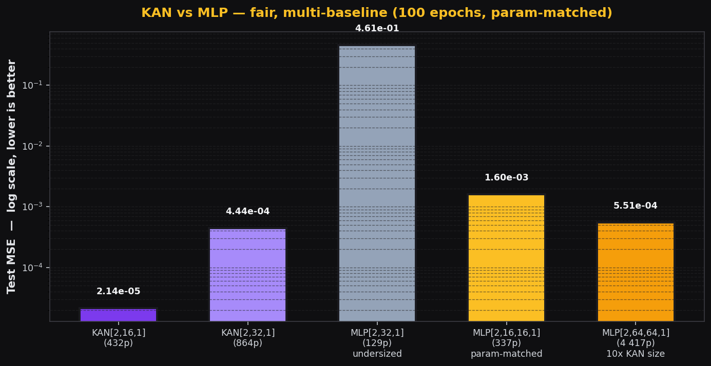

<h1 align="center">🚀 kanx</h1>

<p align="center">
  <strong>Production-grade Kolmogorov-Arnold Networks</strong><br>
  <em>TensorFlow + PyTorch + ONNX — one library, four surfaces.</em>
</p>

<p align="center">
  <a href="https://pypi.org/project/kanx/"></a>
  <a href="https://pypi.org/project/kanx/"></a>
  <a href="https://pepy.tech/project/kanx">  </a>
  <a href="./CITATION.cff"></a>
  <a href="https://github.com/Mattral/KANX/actions/workflows/ci.yml"></a>
  
  <a href="https://mattral.github.io/KANX/"></a>
  <a href="https://colab.research.google.com/github/Mattral/KANX/blob/main/notebooks/quickstart.ipynb"></a>
  <a href="./LICENSE"></a>
  <a href="https://doi.org/10.5281/zenodo.20430883">
    
  </a>

</p>

<p align="center">
  
</p>

> **`pip install kanx`** &nbsp;·&nbsp; A small KAN beats a 10× larger MLP on smooth, separable targets — **honest, param-matched benchmark below.**
> One library. Two backends. Real ONNX export. Docker + Kubernetes ready. Prometheus metrics, TensorBoard logging, Hub and symbolic extras are now implemented.

---


## ⭐ Why kanx?
<div align="center">

Every other KAN library stops at research. `kanx` goes the full distance:

| | [pykan](https://github.com/KindXiaoming/pykan) | [efficient-kan](https://github.com/Blealtan/efficient-kan) | [mlx-kan](https://github.com/Goekdeniz-Guelmez/mlx-kan) | **kanx** |
|---|:---:|:---:|:---:|:---:|
| Framework         | PyTorch | PyTorch | MLX (Apple Silicon) | **TF + PyTorch** |
| Vectorized B-spline | partial | ✅ | ✅ | ✅ |
| ONNX export       | ❌ | ❌ | ❌ | ✅ **both backends** |
| REST API service  | ❌ | ❌ | ❌ | ✅ FastAPI |
| Docker + K8s      | ❌ | ❌ | ❌ | ✅ |
| Property-based tests | ❌ | ❌ | ❌ | ✅ Hypothesis |
| Test coverage     | research | research | research | **94%** |
| PyPI              | ✅ | ✅ | ✅ | ✅ |
| CI/CD release pipeline | ❌ | ❌ | ❌ | ✅ PyPI + GHCR + Pages |

`kanx` is the only KAN library purpose-built for **production deployment**.
Research-y libs are great for novel experiments; kanx is what you ship.
</div>

---

## ⚡ The 30-second magic moment

```python
import kanx

# Build, train, predict — in one call. No config files. No compile dance.
model = kanx.quickstart()                       # trains on synthetic 2-D data
model.predict([[0.5, 0.2]])                     # → array([[1.04…]])
```

> **⚠️ Grid calibration — two methods**
> 
> KANs use B-splines on a fixed input range (default `[-1, 1]`). If your inputs fall outside that range, the spline path **silently returns zero** and you only get the SiLU residual. Fix it one of two ways:
> 
> **Static approach** (pre-training):
> ```python
> from kanx import KAN, fit_grid_to_data
> model = KAN([n_features, 64, 1])
> fit_grid_to_data(model, X_train)              # one-time grid fit
> model.fit(X_train, y_train, epochs=30)
> ```
> 
> **Adaptive approach** (during training — recommended):
> ```python
> model = KAN([n_features, 64, 1])
> model.fit(X_train, y_train, epochs=15)
> model.update_grid_from_samples(X_train)       # ← refine grid based on data
> model.fit(X_train, y_train, epochs=15)        # continue training
> ```
> 
> `kanx.check_input_range(model, X)` will log a warning at inference if input exceeds the grid.

Want more control? Same simplicity, your data:

```python
from kanx import KAN
import numpy as np

X = np.random.uniform(-1, 1, (1024, 2)).astype("float32")
y = np.sin(np.pi * X[:, :1]) + X[:, 1:2] ** 2

model = KAN([2, 64, 1])
model.fit(X, y, epochs=30, verbose=0)           # auto-compiles with Adam+MSE
model.predict(X[:3])
```

### 🔥 PyTorch? Same API.

```python
from kanx.torch import KAN
import torch

model = KAN([2, 64, 1])
X = torch.randn(1024, 2); y = torch.sin(torch.pi * X[:, :1])
model.fit(X, y, epochs=30, lr=1e-2)             # one-liner, same semantics
model.predict([[0.5, 0.2]])
```

### ⚡ GPU-optimized MatrixKAN

For higher throughput on accelerators, use the vectorized `MatrixKAN` (replaces recursion with batched GEMM):

```python
from kanx.torch import MatrixKAN

model = MatrixKAN([4, 32, 1])  # same interface as KAN
model.fit(X, y, epochs=30)      # ~1.5–2× faster on GPU vs standard KAN
```

---

## 📦 Installation

```bash
pip install kanx                # core (TensorFlow)
pip install "kanx[torch]"       # +PyTorch backend
pip install "kanx[onnx]"        # +tf2onnx + onnxruntime
pip install "kanx[api]"         # +FastAPI service
pip install "kanx[hub]"         # +HuggingFace Hub integration
pip install "kanx[symbolic]"    # +Symbolic regression hooks
pip install "kanx[all]"         # everything (api + torch + onnx + hub + symbolic + dev + docs)
```

Optional extras:
* `kanx[api]` adds FastAPI serving with `/metrics` Prometheus scraping.
* `kanx[torch]` adds the PyTorch backend, `MatrixKAN`, and symbolic helpers.
* `kanx[hub]` adds `push_to_hub()` / `from_pretrained()` for HuggingFace integration.
* `kanx[symbolic]` adds `SymbolicFitter` for post-hoc edge function extraction.

→ Open in Colab: **[Train a KAN in 2 minutes](https://colab.research.google.com/github/Mattral/KANX/blob/main/notebooks/quickstart.ipynb)**

---

## 📊 Benchmarks (reproducible, fair, multi-baseline)

<div align="center">
  
Synthetic 2-D regression target `y = sin(π·x₁) + cos(2π·x₂)`,
100 epochs, Adam(lr=1e-2), batch=128, CPU.


| Model              | Params | Train (s) | Infer 4k (ms) | **Test MSE** |
|--------------------|------:|---------:|-------------:|-------------:|
| **KAN[2,16,1]**    |   432 |    12.50 |        68.64 | **2.14 × 10⁻⁵** |
| KAN[2,32,1]        |   864 |    16.62 |        25.52 | 4.44 × 10⁻⁴ |
| MLP[2,32,1]        |   129 |     5.07 |         6.17 | 4.61 × 10⁻¹ (undersized) |
| MLP[2,16,16,1]     |   337 |     5.46 |         4.08 | 1.60 × 10⁻³ |
| MLP[2,64,64,1]     | 4 417 |     6.00 |         5.74 | 5.51 × 10⁻⁴ |

</div>

**Honest read.** The smallest KAN (432 params) wins on this smooth separable
target. The same KAN is ~10–15× *slower at inference* than a same-MSE MLP
because each edge does a B-spline evaluation. On non-smooth or
high-dimensional targets, this picture often reverses. We do not claim KANs
are universally better than MLPs.

Reproduce with `python benchmarks/compare_mlp.py` (quick, 100 epochs) or
`python benchmarks/compare_mlp.py --long` (1000 epochs + early-stopping).

---


## 🌐 REST API

```bash
docker run --rm -p 8000:8000 ghcr.io/mattral/kanx:latest
# or
uvicorn api.app:app --port 8000
```

<div align="center">
  
| Method | Path           | Purpose |
|-------:|:--------------|:--------|
| `GET`  | `/api/health`  | Liveness + model load source |
| `GET`  | `/api/info`    | Version + TF/Torch + model summary |
| `GET`  | `/metrics`     | Prometheus scrape endpoint |
| `POST` | `/api/predict` | Inference (single or batch) |
| `POST` | `/api/load`    | Hot-swap checkpoint |
| `POST` | `/api/reset`   | Re-init from `KANX_CONFIG` |

</div>

```bash
curl -X POST http://localhost:8000/api/predict \
     -H 'content-type: application/json' \
     -d '{"x": [[0.1, -0.2], [0.5, 0.7]]}'
```

The startup contract loads `KANX_CHECKPOINT` if it exists, otherwise falls
back to a fresh model built from `KANX_CONFIG`. Boundaries are validated:
wrong feature count → `400`, oversized batch → `413`, missing checkpoint → `404`.

---

## 🔄 ONNX export

```python
# From PyTorch
from kanx.torch import KAN, export_onnx
model = KAN([2, 64, 1])
export_onnx(model, "kan.onnx")
```

```python
# From TensorFlow
from kanx import KAN, export_onnx_tf
import tensorflow as tf
model = KAN([2, 64, 1]); model(tf.zeros((1, 2)))
export_onnx_tf(model, "kan.onnx")
```

✔ Dynamic batch
✔ Verified numerical consistency (1e-5)
✔ Works with ONNX Runtime / TensorRT / OpenVINO

---

## 🐳 Docker / ☸️ Kubernetes

```bash
docker run --rm -p 8000:8000 ghcr.io/mattral/kanx:latest
kubectl apply -f k8s/    # Deployment + Service + Ingress + HPA + PVC
```

K8s manifests ship with rolling updates, readiness/liveness probes on
`/api/health`, an HPA (2 ↔ 10 replicas, CPU-target 70%) and a PVC for the
model registry.

---

## 🛠️ CLI

```bash
python -m kanx info                                          # versions
python -m kanx train --config configs/default.yaml           # train
python -m kanx predict --checkpoint model.keras --input X.json
```

---

## ⭐ Quality

- **95 tests** across 8 files — unit, integration, E2E, property-based, performance regression
- **94% library coverage** (99% layers, 100% model)
- **Hypothesis property tests**: partition of unity, shape invariants, gradient finiteness
- **Numerical contracts**: ONNX parity within 1e-5, save/load roundtrip identity
- **Performance regression alarms**: latency budgets on forward pass and predict
- CI matrix: Python 3.10 / 3.11 / 3.12 + lint + Docker smoke + MkDocs build

```bash
pytest tests/ -v --cov=src/kanx
```

---

## 📚 Documentation

<div align="center">

→ **<https://mattral.github.io/KANX/>** (MkDocs Material)

| Page | What's inside |
|------|---------------|
| [Quickstart](https://mattral.github.io/KANX/quickstart/) | Train your first KAN in 60 seconds |
| [Architecture](https://mattral.github.io/KANX/architecture/) | Package layout, module contracts |
| [System Design](https://mattral.github.io/KANX/system_design/) | Serving topology, scaling, failure modes |
| [REST API](https://mattral.github.io/KANX/api/) | Endpoint reference + curl examples |
| [Testing](https://mattral.github.io/KANX/testing/) | Test pyramid, numerical invariants |
| [Deployment](https://mattral.github.io/KANX/deployment/) | CI/CD, rollout, observability |
| [Benchmarks](https://mattral.github.io/KANX/benchmarks/) | KAN vs MLP — methodology + numbers |

</div>

---

## 📄 Research Paper

If you use kanx in academic work, please cite both the original paper and
the library. 

Our work is formally documented and available as a preprint:

- 📘 Title: *Bridging Theory and Practice with KANX*
- 📍 DOI: https://doi.org/10.5281/zenodo.20430883
- 📂 Zenodo: https://zenodo.org/records/20430883
- 📄 [Read Paper (preprint)](docs/preprint.pdf)
- 📄 [Read Paper (ArXiv)](docs/KANX_ArXiv_Paper.pdf)


### Citation

```bibtex
@article{mattral2026kanx,
  title={Bridging Theory and Practice with KANX},
  author={Myet, Min Htet},
  year={2026},
  doi={10.5281/zenodo.20430883},
  publisher={Zenodo}
}

@article{liu2024kan,
  title   = {KAN: Kolmogorov-Arnold Networks},
  author  = {Liu, Ziming and Wang, Yixuan and Vaidya, Sachin and Ruehle,
             Fabian and Halverson, James and Soljačić, Marin and
             Hou, Thomas Y. and Tegmark, Max},
  journal = {arXiv preprint arXiv:2404.19756},
  year    = {2024}
}
```

### References

- Liu et al., *KAN: Kolmogorov-Arnold Networks* — [arXiv:2404.19756](https://arxiv.org/abs/2404.19756)
- The Kolmogorov-Arnold representation theorem ([Wikipedia](https://en.wikipedia.org/wiki/Kolmogorov%E2%80%93Arnold_representation_theorem))
- B-splines & de Boor algorithm — [Carl de Boor (1972)](https://doi.org/10.1016/0021-9045(72)90080-9)

---

## 🤝 Contributing

PRs welcome! See [`CONTRIBUTING.md`](CONTRIBUTING.md). Good places to start:

- 🔖 [Good first issues](https://github.com/Mattral/KANX/labels/good%20first%20issue)
- 🗺️ [`roadmap.md`](roadmap.md) — P0 / P1 / P2 backlog
- 💬 [Discussions](https://github.com/Mattral/KANX/discussions)

---

## 📜 License

[Apache 2.0](LICENSE). Use it. Ship it. Tell us when you do — we'd love to
hear how kanx is being used in the wild.

<p align="center">⭐ <strong>Star the <a href="https://github.com/Mattral/KANX">repo</a></strong> if kanx saved you time!</p>
